  

div>

 

---

### About SecureGeneration

SecureGeneration is an independent, community-driven security research collective. We build vendor-neutral evaluation frameworks for emerging technology security domains — establishing measurable standards before markets lock in around marketing claims.

We believe accountability requires measurement, and measurement requires community consensus.

---

### Current Project

**PRISM** — Prompt Risk & Injection Scenario Matrix

The first open framework for evaluating how AI security products perform against real-world attack scenarios. Scenario-based. MITRE ATLAS-aligned. Four-dimension scoring across Prevent, Detect, Contain, and Attribute.

→ **[github.com/SecureGeneration/prism](https://github.com/SecureGeneration/prism)**

---

  Community-driven &nbsp;·&nbsp; Vendor-neutral &nbsp;·&nbsp; Open sourcesub>

div>
